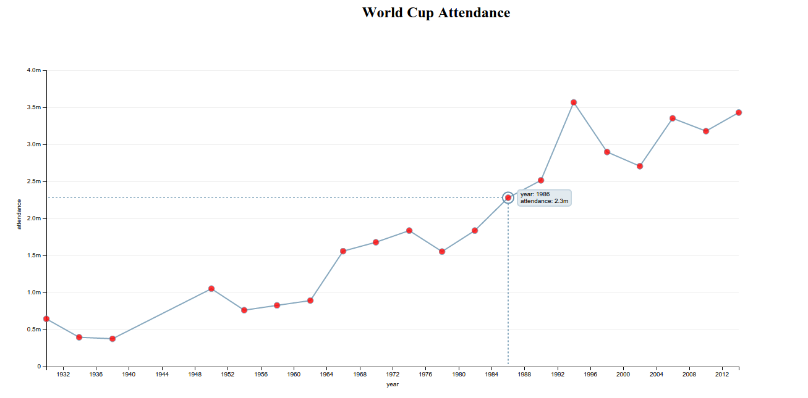
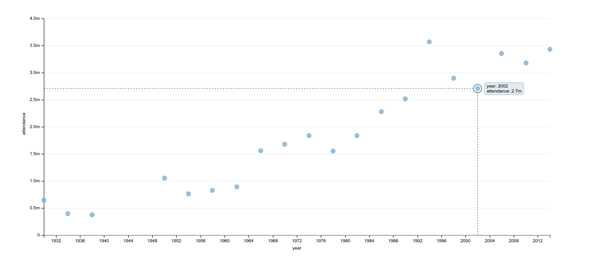

### dimplejs sample projects on World Cup database
Some dimplejs jobs on World Cup database as the samples of experience.

To avoid CORS problem, run a simple server on your local machine.

`serve` with nodejs or `python -m SimpleHTTPServer`

Three charts are provided with this data: The `time` on `X axis` is formated to show only years, and for `every four years`. The `y axis` is number of attendees for whole games of that year. If we hoverover the chart an line will connet the head of the point to `x` and `y` axises and more detailed information wil be shown.

- Scatter mixed with line chart: which I added some CSS to make points red, and also a title through d3 methods.

- Scatter chart

- Bar chart

### Following are used
- HTML5
- CSS
- JavaScript
- D3.js
- Dimple.js
