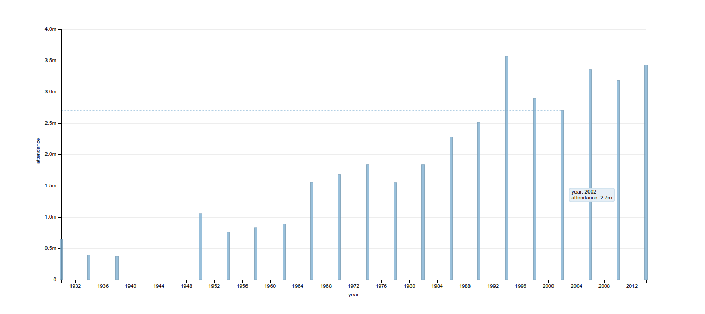

# dimplejs sample projects on worldcup database
Some dimplejs jobs on World Cup database as the samples of experience.

To avoid CORS problem, run a simple server on your local machine.

`serve` with nodejs or `python -m SimpleHTTPServer`

The bar chart sample for world cup is drawn bellow. The `time` on `X axis` is formated to show only years, and for `every four years`. The `y axis` is number of attendees for whole games of that year. If we hoverover the bars an line will connet the head of the bar to `y` axis and more detailed information are shown from that bar.

